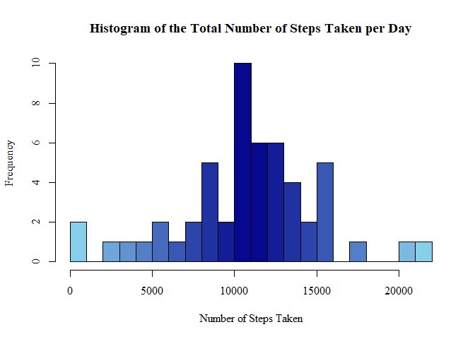
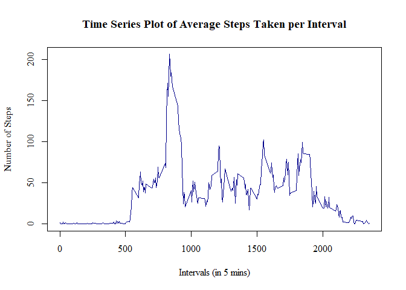
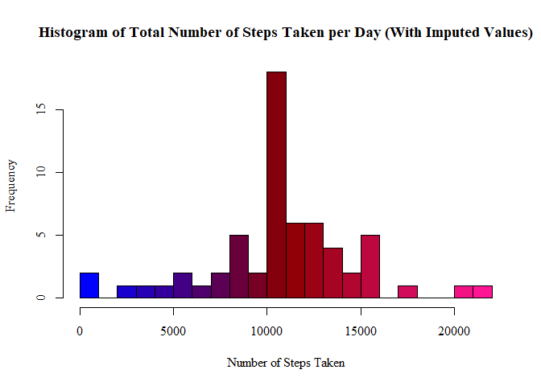
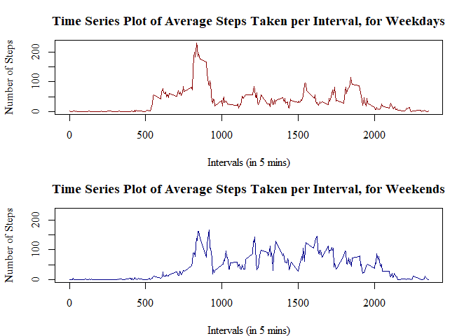

## Q1: Loading and preprocessing the data


``` r
unzip("data_activity.zip")
data <- read.csv("activity.csv", colClasses=c("numeric", "Date", "numeric"))
```

Confirm the data dimensions and contents.


``` r
head(data)
```

```
##   steps       date interval
## 1    NA 2012-10-01        0
## 2    NA 2012-10-01        5
## 3    NA 2012-10-01       10
## 4    NA 2012-10-01       15
## 5    NA 2012-10-01       20
## 6    NA 2012-10-01       25
```

``` r
str(data)
```

```
## 'data.frame':	17568 obs. of  3 variables:
##  $ steps   : num  NA NA NA NA NA NA NA NA NA NA ...
##  $ date    : Date, format: "2012-10-01" "2012-10-01" ...
##  $ interval: num  0 5 10 15 20 25 30 35 40 45 ...
```

## Q2:  What is mean total number of steps taken per day?


``` r
cleandata <- data[!(is.na(data$steps)), ]
```

To calculate the total number of steps taken per day, i grouped separately for each day, and then the sum of each group


``` r
totalStepsDay <- aggregate(steps ~ date, cleandata, sum)
head(totalStepsDay)
```

```
##         date steps
## 1 2012-10-02   126
## 2 2012-10-03 11352
## 3 2012-10-04 12116
## 4 2012-10-05 13294
## 5 2012-10-06 15420
## 6 2012-10-07 11015
```

I created exploratory plots to able to quickly see all of the data, and check any potential patterns. This histogram is created to show the frequency of total steps taken each day.


``` r
paletteBlue <- colorRampPalette(c("skyblue", "darkblue", "skyblue"))
hist(totalStepsDay$steps, breaks=20, xlab="Number of Steps Taken", 
     main="Histogram of the Total Number of Steps Taken per Day",
     col=paletteBlue(22), family="serif")
```

<!-- -->

lastly, using the summarise function I calculate the mean and median values of the total number of steps taken per day.


``` r
library(dplyr)
totalStepsSummary <- summarise(totalStepsDay, meanOfTotalSteps=mean(totalStepsDay$steps),
                               medianOfTotalSteps=median(totalStepsDay$steps))
print(totalStepsSummary)
```

```
##   meanOfTotalSteps medianOfTotalSteps
## 1         10766.19              10765
```


## Q3: What is the average daily activity pattern?


I use time a time series plot to look at the average daily pattern. firstly found the means steps before the plot


``` r
meanStepsInterval <- aggregate(steps ~ interval, cleandata, mean)
head(meanStepsInterval)
```

```
##   interval     steps
## 1        0 1.7169811
## 2        5 0.3396226
## 3       10 0.1320755
## 4       15 0.1509434
## 5       20 0.0754717
## 6       25 2.0943396
```

Create time series plot, with each interval on the x axis, and the average steps data on the y axis.


``` r
plot(x=meanStepsInterval$interval, y=meanStepsInterval$steps, type="l",
     main="Time Series Plot of Average Steps Taken per Interval",
     ylab="Number of Steps", xlab="Intervals (in 5 mins)",
     col="darkblue", lwd=1.5, family="serif")
```

<!-- -->

Lastly "which five minute interval contains the maximum number of steps?" To answer this the max function is used 


``` r
meanStepsInterval[grep(max(meanStepsInterval$steps), meanStepsInterval$steps), ]
```

```
##     interval    steps
## 104      835 206.1698
```


## Q4: Imputing missing values

The data contain NA values as some of the observations is missing


``` r
anyNA(data)
```

```
## [1] TRUE
```

Looking at each of the variables:


``` r
data.frame(steps=sum(is.na(data$steps)), 
           interval=sum(is.na(data$interval)), 
           date=sum(is.na(data$date)))
```

```
##   steps interval date
## 1  2304        0    0
```

All the NA values are within the steps variable a total of 2304.

To address the missing values, an imputation strategy needs to be developed to substitute them with valid numeric values. I have chosen to replace each missing value with the mean value for the corresponding interval, calculated as the average across all days.


``` r
imputed <- data
for(x in 1:17568) {
    if(is.na(imputed[x, 1])==TRUE) {
        imputed[x, 1] <- meanStepsInterval[meanStepsInterval$interval %in% imputed[x, 3], 2]
    }
}
head(imputed)
```

```
##       steps       date interval
## 1 1.7169811 2012-10-01        0
## 2 0.3396226 2012-10-01        5
## 3 0.1320755 2012-10-01       10
## 4 0.1509434 2012-10-01       15
## 5 0.0754717 2012-10-01       20
## 6 2.0943396 2012-10-01       25
```

Now that the NA values have been replaced, a histogram from the imputed data is created. .


``` r
imputedTotalStepsDay <- aggregate(steps ~ date, imputed, sum)
head(imputedTotalStepsDay)
```

```
##         date    steps
## 1 2012-10-01 10766.19
## 2 2012-10-02   126.00
## 3 2012-10-03 11352.00
## 4 2012-10-04 12116.00
## 5 2012-10-05 13294.00
## 6 2012-10-06 15420.00
```

Creating the histogram:


``` r
paletteRed <- colorRampPalette(c("blue", "darkred", "deeppink"))
hist(imputedTotalStepsDay$steps, breaks=20, xlab="Number of Steps Taken", 
     main="Histogram of Total Number of Steps Taken per Day (With Imputed Values)",
     col=paletteRed(22), family="serif")
```

<!-- -->

Calculation of the mean and median total number of steps taken per day.


``` r
imputedStepsSummary <- summarise(imputedTotalStepsDay, 
                                 meanOfTotalSteps=mean(imputedTotalStepsDay$steps), 
                                 medianOfTotalSteps=median(imputedTotalStepsDay$steps))  
print(imputedStepsSummary)
```

```
##   meanOfTotalSteps medianOfTotalSteps
## 1         10766.19           10766.19
```


## Q5 Are there differences in activity patterns between weekdays and weekends?

To answer this question I used the imputed data.  


``` r
daysData <- imputed
daysData$days <- weekdays(daysData$date)
daysData$weekday <- as.character(rep(0, times=17568))
for(x in 1:17568) {
    if(daysData[x, 4] %in% c("Saturday", "Sunday")) {
        daysData[x, 5] <- "weekend"
    } else {
        daysData[x, 5] <- "weekday"
    }
}
daysData$weekday <- factor(daysData$weekday)
head(daysData)
```

```
##       steps       date interval   days weekday
## 1 1.7169811 2012-10-01        0 Monday weekday
## 2 0.3396226 2012-10-01        5 Monday weekday
## 3 0.1320755 2012-10-01       10 Monday weekday
## 4 0.1509434 2012-10-01       15 Monday weekday
## 5 0.0754717 2012-10-01       20 Monday weekday
## 6 2.0943396 2012-10-01       25 Monday weekday
```

To compare the weekday and weekend data, and create two plots of the average number of steps taken per interval, the data has to be split into two groups of weekday/weekend data, using the newly created variable.


``` r
weekdayData <- daysData[daysData$weekday=="weekday", ]
weekendData <- daysData[daysData$weekday=="weekend", ]
```

Next, the average number of steps per interval is calculated, much like it has been done in previous questions.


``` r
weekdayMean <- aggregate(steps ~ interval, weekdayData, mean)
weekendMean <- aggregate(steps ~ interval, weekendData, mean)
```

Finally the panel plot is created. The x axis indicates each 5 minute interval, and the y axis shows the average number of steps taken. The two plots are divided into weekday, and weekend data.


``` r
par(mfrow=c(2, 1), mar=c(4, 4.1, 3, 2.1))
plot(weekdayMean$interval, weekdayMean$steps, type="l",
     main="Time Series Plot of Average Steps Taken per Interval, for Weekdays",
     xlab="Intervals (in 5 mins)", ylab="Number of Steps", family="serif",
     col="darkred", lwd=1.5, ylim=c(0, 230))
plot(weekendMean$interval, weekendMean$steps, type="l",
     main="Time Series Plot of Average Steps Taken per Interval, for Weekends",
     xlab="Intervals (in 5 mins)", ylab="Number of Steps", family="serif",
     col="darkblue", lwd=1.5, ylim=c(0, 230))
```

<!-- -->
